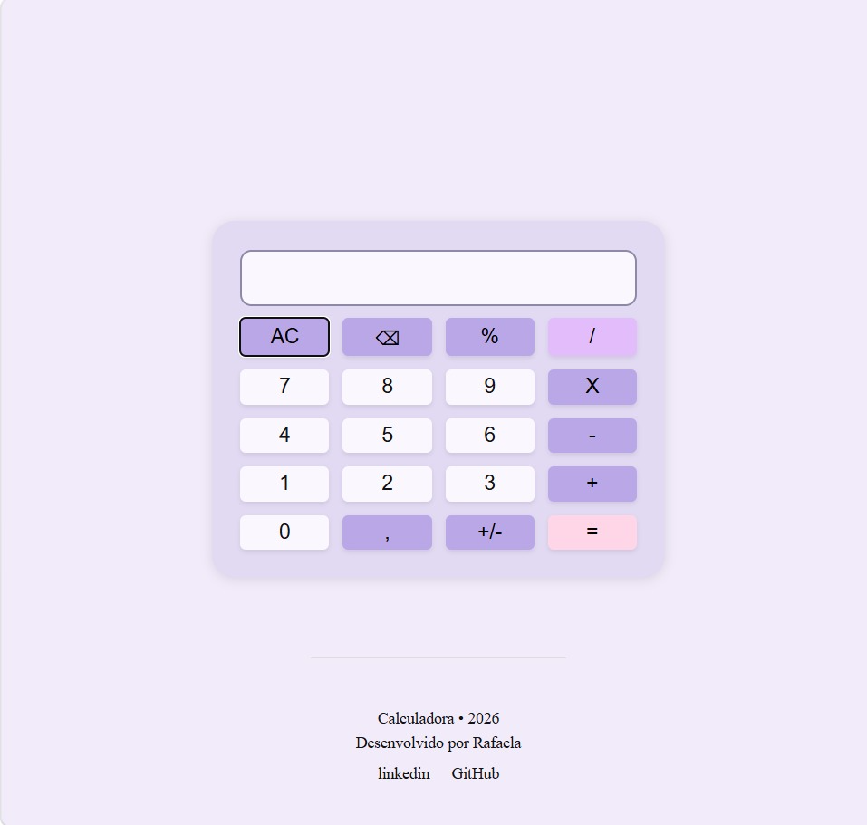

# 🧮 Calculadora

Projeto de uma calculadora desenvolvida com HTML, CSS e JavaScript, criado com o objetivo de praticar conceitos básicos de desenvolvimento web e lógica de programação.

## 📌 Sobre o projeto

Esta calculadora permite realizar operações matemáticas básicas diretamente pelo navegador.

O projeto foi desenvolvido como parte dos meus estudos em JavaScript, colocando em prática conceitos como manipulação do DOM, eventos de clique, variáveis, funções, condições e operações matemáticas.

## 🚀 Funcionalidades

- ➕ Adição
- ➖ Subtração
- ✖️ Multiplicação
- ➗ Divisão
- % Porcentagem
- 🔢 Números positivos e negativos
- 🔙 Apagar o último número
- 🧹 Limpar o visor
- 🔢 Números decimais
- 🟰 Exibição do resultado da operação

## 🛠️ Tecnologias utilizadas

- HTML5
- CSS3
- JavaScript

## 🧠 O que pratiquei neste projeto

Durante o desenvolvimento, pratiquei:

- Declaração e utilização de variáveis com `let` e `const`
- Seleção de elementos HTML com `querySelector` e `querySelectorAll`
- Manipulação do DOM
- Eventos com `addEventListener`
- Funções
- Estruturas condicionais com `if` e `else`
- Uso de `forEach`
- Operações matemáticas em JavaScript
- Conversão de valores com `Number()`
- Manipulação de strings
- Uso do método `replace()`
- Uso do método `split()`
- Uso do método `slice()`
- Organização de HTML, CSS e JavaScript em arquivos separados

## 💻 Como executar o projeto

1. Faça o download ou clone este repositório.
2. Abra a pasta do projeto no Visual Studio Code.
3. Abra o arquivo `index.html` utilizando o Live Server.
4. A calculadora será aberta no navegador.
